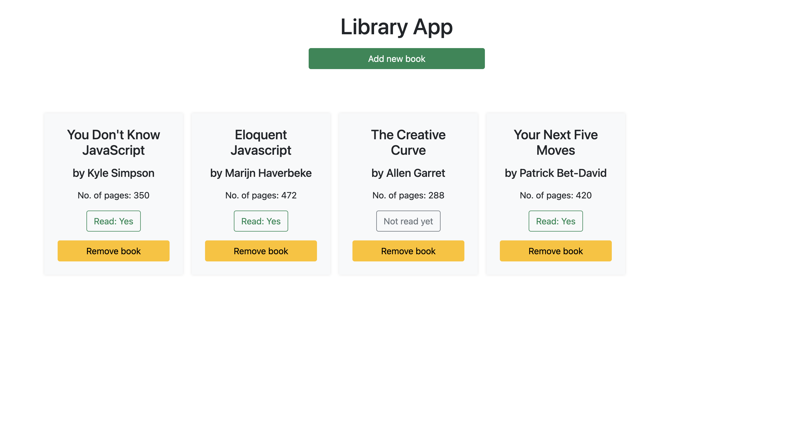

## My Library App

## Live Link
Visit the [Library App](https://george-swift.github.io/my-library/)
## Features

> The library app allows users to add books to local storage. Books are added to the library by author, title and number of pages. A checkbox allows users to say if they have read the book before adding it to the collection. Users can toggle the 'Read' status from the library. Click the remove button to remove a book from storage.

## Prerequisites
- Internet Connection
- Affinity for reading books

## Built With
- JavaScript ES6
- HTML5/CSS3
- BootStrap

## Getting Started
- To get started with the app, clone this project by running `git clone https://github.com/george-swift/my-library.git`
- Open the directory in any preferred IDE on a local machine to view source files
- Visit the [live link](https://george-swift.github.io/my-library/) to use the Library App

## Authors

👤 &nbsp; **Ubong George**
- LinkedIn: [Ubong George](https://www.linkedin.com/in/ubong-itok)
- Twitter: [@\_\_pragmaticdev](https://twitter.com/__pragmaticdev)
- GitHub: [@george-swift](https://github.com/george-swift)

## Acknowledgments

- Authors of insightful books displayed in screenshot

## Show your support

Leave a :star:️ &nbsp; if you like this project!

